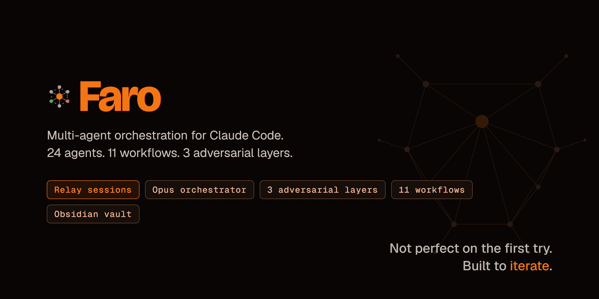
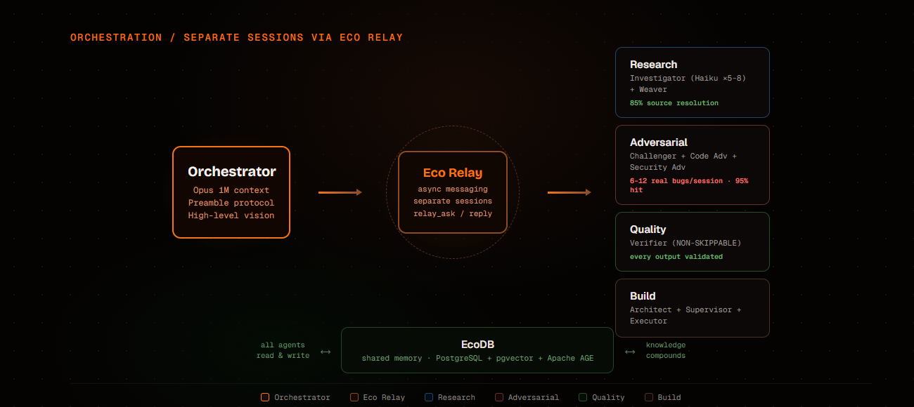
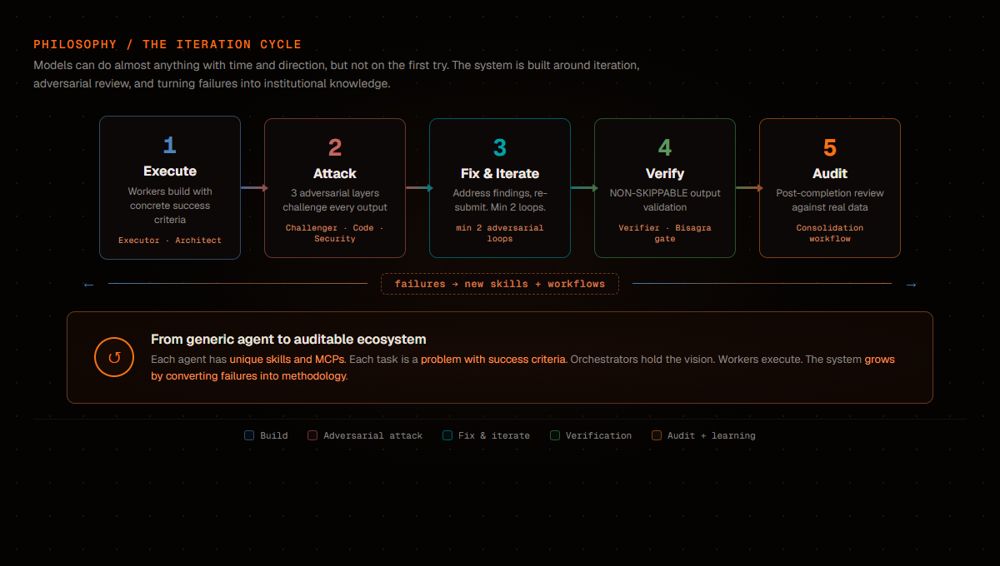

<p align="center">
  
</p>

<p align="center">
  <a href="LICENSE"></a>
  
  
  
  
</p>

Faro is a multi-agent orchestration system for [Claude Code CLI](https://docs.anthropic.com/en/docs/claude-code). An Opus orchestrator coordinates 24 specialized agents (Sonnet/Haiku) via inter-session messaging and produces formal artifacts at each stage.

Built and used in production over 82 days. 437 sessions analyzed. 989 MB of logs audited.

**This repository is open for inspection, not for installation.** It's a portfolio piece showing the methodology, agent definitions, workflow contracts, and real metrics from production use. The system runs inside an Obsidian vault with EcoDB and Eco Relay as infrastructure — those are separate projects.

**Recommended base:** [Obsidian](https://obsidian.md/) vault. Faro's agents, workflows, templates, and session artifacts are structured as an Obsidian vault with wiki-links and frontmatter. The vault is the single source of truth for the entire system.

## Why separate sessions?

Most multi-agent frameworks run sub-agents inside the parent's context window. Faro doesn't. Each agent runs as a separate Claude Code session with its own full context window, CLAUDE.md identity, and tool access.

| Aspect | Sub-agents | Faro (separate sessions) |
|--------|:---:|:---:|
| Context per agent | Shared (shrinks) | Full (independent) |
| Agent crashes | Parent loses context | Only that session affected |
| Parallel work | Limited by parent context | True parallelism |
| Identity persistence | Prompt injection risk | CLAUDE.md per agent |
| Memory between sessions | Lost | EcoDB shared memory |
| Communication | Function calls | Eco Relay (async messaging) |

<p align="center">
  
</p>

## How it works

```
Orchestrator (Opus, 1M context)
    ├── relay_ask → Investigator 1 (Haiku, separate session)
    ├── relay_ask → Investigator 2 (Haiku, separate session)
    ├── relay_ask → Investigator 3 (Haiku, separate session)
    ├── relay_ask → Weaver (Sonnet, synthesizes findings)
    ├── relay_ask → Challenger (Sonnet, attacks the synthesis)
    └── relay_ask → Verifier (Sonnet, validates output)

Each agent:
  - Own context window (no sharing)
  - Own CLAUDE.md (identity + role + constraints)
  - Own MCP tools
  - Reports back via relay_reply
```

The orchestrator follows a shared **Orchestrator Preamble** — a protocol fragment encoding coordination rules, logging requirements, enforcement mechanisms, and escalation paths. Any Opus instance can orchestrate by reading the Preamble. The methodology is in the documents, not in the model's memory.

## Three adversarial layers

Every significant output passes through adversarial review before delivery. This is non-skippable — the orchestrator cannot bypass it.

<p align="center">
  
</p>

| Layer | Agents | Catches |
|-------|--------|---------|
| **Conceptual** | Challenger, Design Adversarial | Wrong assumptions, spec gaps, design flaws |
| **Technical** | Code Adversarial, Security Adversarial | LFI, SSRF, injection, logic bugs — 6-12 real bugs/session, 95% hit rate |
| **Visual** | Visual Adversarial | Design quality, brand compliance, accessibility |

## 11 Workflows

| Workflow | Purpose |
|----------|---------|
| **Design** | Brief → Spec → Plan before building. Investigator contingency. |
| **Construction** | Build from scratch. Supervisor + Verifier as beta tester. |
| **Evolution** | Refactor existing code/systems. |
| **Integration** | Install external technology. |
| **Adaptation** | Connect external tools to internal ecosystem. |
| **Newspaper** | Daily personal HTML newspaper. |
| **Investigation** (lightweight) | 1 loop, Haiku Investigators, Sonnet Weaver. |
| **Investigation** (deep) | 2+ loops, Haiku Investigators, Opus Weaver. |
| **R&D** | Strategic evaluation. Advisory Council (Pioneer/Guardian/Pragmatist). |
| **Consolidation** | Periodic system audit against real usage data. |
| **Project Synthesis** | Definitive truth document when a project completes. |

Each workflow is a SKILL file — a formal contract that any new model instance can follow without inventing. The orchestrator reads the SKILL, follows the steps, produces the artifacts.

## 24 Agents

| Role | Agent | Model | Purpose |
|------|-------|-------|---------|
| Orchestration | Architect | Opus | Designs specs, reviews architecture |
| | Supervisor | Opus | Manages team execution |
| | Executor | Sonnet | Implements plans mechanically |
| Research | Investigator | Haiku (×5-8) | Parallel research with source verification |
| | Weaver | Sonnet/Opus | Synthesizes investigator findings |
| | Source Critic | Sonnet | Validates source quality |
| Quality | Verifier | Sonnet | NON-SKIPPABLE output verification |
| | Challenger | Sonnet | Conceptual adversarial |
| | ChallengerSpec | Sonnet | Spec-level adversarial |
| Adversarial | Code Adversarial | Sonnet | Finds security/logic bugs |
| | Security Adversarial | Sonnet | Security-focused review |
| | Design Adversarial | Sonnet | Attacks briefs and designs |
| | Visual Adversarial | Sonnet | Visual quality check |
| Advisory | Pioneer | Sonnet | Innovation perspective (R&D) |
| | Guardian | Sonnet | Stability perspective (R&D) |
| | Pragmatist | Sonnet | Cost/benefit perspective (R&D) |
| Support | Scribe | Sonnet | Archives to vault + EcoDB |
| | Archivist | Haiku | Pre-flight checks, collection |
| | Designer | Sonnet | 3 modes: generic/auditor/connector |
| | Editor | Sonnet | Content editing |
| | Analyst | Sonnet | Data analysis |
| | Layout Designer | Sonnet | Newspaper layout |
| | News Researcher | Haiku | News source research |

## Key decisions

1. **Relay over sub-agents.** Separate sessions give each agent a full context window. No context sharing, no cascading failures.

2. **Orchestrator Preamble.** Protocol without identity. The rules are shared; the personality is per-agent. A new Opus instance reads the Preamble and can orchestrate immediately.

3. **SKILLs as contracts.** Workflow methodology lives in SKILL files, not in model memory. Survives compaction, model changes, and session boundaries.

4. **Bisagras (gates).** Mandatory human checkpoints at key decision points. No autonomy past the gate without explicit approval.

5. **EcoDB as shared memory.** All agents write to one memory system. Knowledge compounds across sessions instead of being lost at session end.

6. **Three adversarial layers.** Conceptual + technical + visual review. Non-skippable. The orchestrator cannot bypass adversarial review.

## Real metrics

From a full system audit (2026-05-23): 437 sessions analyzed, 989 MB of logs processed, 7 investigators across 2 analysis layers.

| Metric | Value |
|--------|-------|
| Days in production | 82 |
| Sessions analyzed | 437 |
| Relay dispatches | 200+ |
| Design regressions | 0 |
| Bugs caught per session (adv-code) | 6-12 |
| Adversarial hit rate | 95% |
| Investigator source resolution | 85% via WebFetch |
| Consolidation findings | 131 raw → 48 consolidated |
| Adversarial loops per review | 3-4 typical |

### Patterns discovered in production

- **Bisagras (decision gates):** 100% adoption across investigation and design workflows.
- **IRC-style rooms for consensus:** double-rounding converts 3-2 splits to 5/5 unanimity.
- **Parallel dispatch batching:** build batch N+1 while reviewing batch N. Zero idle time.
- **Caveman + English relay:** 7% of token budget vs 15-20% without compression.

## Repository contents

```
├── Skills/                    # 11 workflow SKILLs
├── Agents/                    # 24 agent CLAUDE.md files
├── Documentation/
│   ├── FARO_ESTADO.md         # Complete system state
│   ├── ORCHESTRATOR_PREAMBLE.md
│   └── GLOSSARY.md
├── Templates/                 # 21 artifact templates
├── docs/images/               # Architecture diagrams
├── abstract.py                # Public variant generator
├── README.md
└── LICENSE                    # MIT
```

> **Note:** Agent CLAUDE.md files and SKILLs in this repository are abstracted variants — no MCP tool calls, no named identities, no internal infrastructure references. The methodology is preserved; the implementation details are removed.

## Infrastructure (separate projects)

Faro depends on two other systems that are separate repositories:

- **[EcoDB](https://github.com/josortmel/ecodb)** — Shared AI memory infrastructure. PostgreSQL + pgvector + Apache AGE. Semantic search, knowledge graph, entity extraction.
- **[Eco Relay](https://github.com/josortmel/eco-relay)** — Inter-session messaging for Claude Code. relay_ask, relay_reply, relay_room.

## License

MIT — see [LICENSE](LICENSE).

---

<p align="center">
  <sub>Built by <a href="https://github.com/josortmel">josortmel</a> — part of the Eco Consulting AI infrastructure.</sub>
</p>
